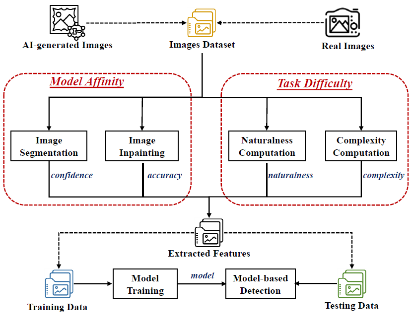

# FakeImageScan  
**Beyond Visual Artifacts: Detecting AI-Generated Images via Model Affinity and Task Difficulty**

FakeImageScan is a **dual-pathway framework** for detecting AI-generated images produced by **GANs and diffusion models**.  
Instead of relying on fragile visual artifacts or generator-specific fingerprints, FakeImageScan exploits **model affinity** and **task difficulty** signals to achieve **robust, generator-agnostic detection**.

---

## 📌 Key Insight

> **AI-generated images are intrinsically more compatible with AI vision models than real images.**

FakeImageScan detects this asymmetry by jointly measuring:
- **How well AI models perform on an image** (*Model Affinity*), and  
- **How difficult the image should be for those tasks** (*Task Difficulty*).

A mismatch between these two signals provides a powerful cue for identifying synthetic images.

---

## 🔍 Framework Overview



FakeImageScan consists of **two complementary pathways** that operate in parallel on each input image.

---

## 📁 Dataset Structure

The dataset follows a **binary folder structure** with two classes: **Real** and **AI-Generated** images.

```plaintext
data/
├── Real/
│   ├── image1.png
│   ├── image2.png
│   ├── image3.png
│   └── ...
└── AI_generated/
    ├── image1.png
    ├── image2.png
    ├── image3.png
    └── ...
```
### 🔍 Feature Semantics

The four-dimensional feature vector is derived from two complementary pathways that capture **model behavior** and **task context**.

---

## 1️⃣ Model Affinity Pathway (Performance Signals)

This pathway measures how confidently AI models process an image.

### 🔹 Inpainting Accuracy (SSIM-based)

Compute inpainting accuracy by comparing the original image with the inpainted (completed) image using **SSIM**:

```bash
python Accuracy.py \
  --original_dir /path/to/img_org \
  --completed_dir /path/to/img_out \
  --output_dir /path/to/output
```
**Observation:**  
AI-generated images tend to be reconstructed with **unusually high accuracy** due to their structural regularity and lack of physical noise.

---

### 🔹 Segmentation Confidence

Compute segmentation confidence by measuring the average per-pixel probability from a semantic segmentation model:

```bash
python confidence.py \
  --input_dir /path/to/images \
  --output_csv results/confidence.csv
```

**Observation:**  
Synthetic images often produce **over-confident and spatially uniform segmentation predictions**, reflecting unnaturally clean boundaries and simplified textures.

---

## 2️⃣ Task Difficulty Pathway (Context Signals)

This pathway estimates how challenging the image *should be* for vision models.

### 🔹 Pixel Naturalness (N)
- Measures pixel-level predictability using a combination of **global and local probability models**.
- Captures how statistically “natural” an image is.

**Interpretation:**  
Real images contain sensor noise and physical irregularities, while AI-generated images exhibit higher predictability.

---

### 🔹 Image Complexity

Compute image complexity by aggregating multiple structural and statistical cues, including edge density, texture variance, entropy, and frequency-domain characteristics:

```bash
python complexity.py \
  --input_dir /path/to/images \
  --output_csv results/complexity.csv
``` 

**Purpose:**  
Image complexity normalizes model performance and prevents visually simple images from being falsely flagged.

## ▶️ Run FakeImageScan (Excel Input & Output)

FakeImageScan supports loading **precomputed feature vectors from an Excel file** and saving **classification results to a new Excel file**.

```bash
python run_fakeimagescan.py \
  --input_excel data/features.xlsx \
  --output_excel results/predictions.xlsx
```
